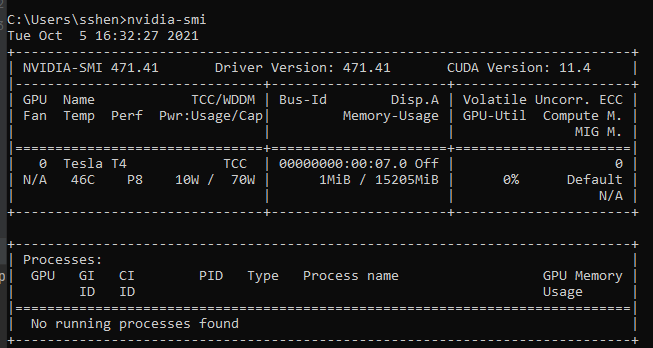
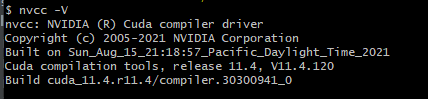
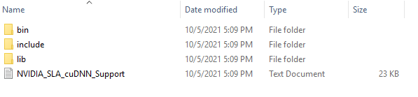
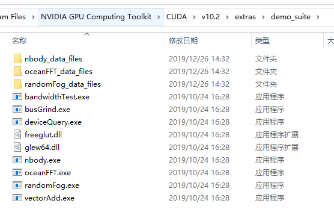
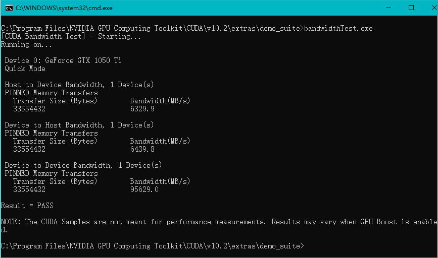
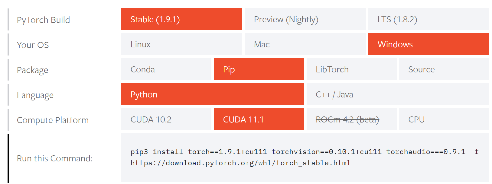
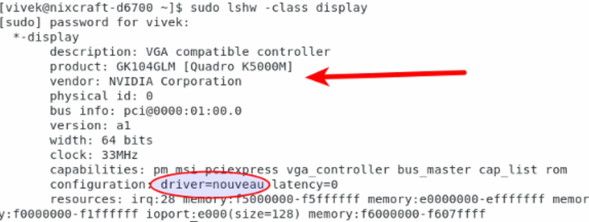
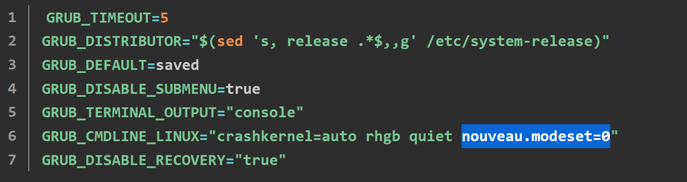

# 🙈 Use pretrained weights
If you wanna get the pretrained model, just run the codes as follows:
```
import torch
import segmentation_models_pytorch as smp

model = smp.Unet(encoder_name="mobilenet_v2", encoder_weights=None, in_channels=3, classes=2)
state_dict = torch.load('unet_pseudo_mobilenetv2_round2_0.pth')
model.load_state_dict(state_dict)
print(model.eval())
```
Then you could use the model to do the prediction.

# 🙊 Environment Configuration
## 🎏 Windows

### 👆 Install NVIDIA Driver
When you finished, you could enter cnvidia-smi` in command prompt
You are success if you see the info as below:

You could see your CUDA version is 11.4, Drive version is 471.41

### ✌ Install CUDA
According to the indormation above, visiting the CUDA download page, and choose corresponding version:
[CUDA Toolkit](https://developer.nvidia.com/cuda-downloads)
install the CUDA. In general, CUDA will add path under environment automatically. If not, please add path manually.
Then, enter `nvcc -V` in command prompt, you will see the CUDA version information


### 👌 Install cuDNN
Good. After installing CUDA, please download cuDNN from the page:[cuDNN](https://developer.nvidia.com/cuda-downloads)
You should register and then download a zip file. Unzip the file, you could get some files:

Copy the files to CUDA installed location correspondingly.
And then, move to `demo_suit`:

Try to run `deviceQuery.exe` and `bandwidthTest.exe`, if you see the `Result = PASS`. Congratulations! You are success.


### 🤚 Install Pytorch
Visit the website to find a suitable Pytorch version: [Pytorch](https://pytorch.org/)
Copy the command and run on your computer.


### 🖐️ Check
Congratulations! You almost down, please run the code as follows to check the environment:
```
import torch
print(torch.cuda.is_available())
print(torch.cuda.device_count())
```
If the outputs are `True`, you are finished.

Otherwise, please check your runtime environment. Do you have venv? Or is it under a wrong Conda env?

## 🎏 CentOS
### 0️⃣ Prepare
In case your suffered denied permission, please do the check and install under the root user.

Check your environment
```
$ sudo yum update
```
Find out info about the Nvidia GPU on CentOS 7:
```
$ lspci | grep -i --color 'vga\|3d\|2d'
```
OR
```
$ sudo lshw -class display
```
that the open source `nouveau` nvidia driver is currently in use.


### 1️⃣ Download the NVIDIA driver
visit [NVIDIA Driver Downloads](https://www.nvidia.com/Download/index.aspx) and grab the drivers for your centos system.
```
$ wget [your driver link]
```
OR
```
$ crul -O [your driver link]
```
If you don't have wget or crul, please use yum to download them:
```
$ yum install wget
```

### 2️⃣ Install all prerequisites for a successful Nvidia driver compilation and installation
One must install `kernel-devel` and gcc kernel on a CentOS 7:
```
$ sudo yum group install "Development Tools"
$ sudo yum install kernel-devel
```
You must install `dkms` for registering the NVIDA kernel module with DKMS:
```
$ sudo yum -y install epel-release
$ sudo yum -y install dkms
```

### 3️⃣ Disable nouveau driver
Disable `nouveau` driver by changing the configuration `/etc/default/grub` file. 
```
$ sudo vi /etc/default/grub
```
Add the `nouveau.modeset=0` into line starting with `GRUB_CMDLINE_LINUX`.

Save the edit by press `esc` and `:wq`

Once ready execute the following command to apply the new GRUB configuration change:

BIOS USER run this
```
$ sudo grub2-mkconfig -o /boot/grub2/grub.cfg
```
UEFI USER run this
```
$ sudo grub2-mkconfig -o /boot/efi/EFI/redhat/grub.cfg
```

### 4️⃣ reboot
The last step to configure the environment is reboot the machine
```
$ sudo reboot
```

### 5️⃣ Insatlling Nvidia driver on CentOS 7
The Nvidia drivers must be installed while Xorg server is stopped. Switch to text mode by:
```
$ systemctl isolate multi-user.target
```
Install the Nvidia driver by executing the following command:
```
$ sudo bash NVIDIA-Linux-x86_64-410.78.run
```
When prompted answer `yes` to continue installation.

### 6️⃣ Check
Same as windows


## 🅾️ There are some errors I meet in Windows: 
```
OSError: [WinError 1455] The paging file is too small for this operation to complete. Error loading "C:\Program Files (x86)\Python\lib\site-packages\torch\lib\caffe2_detectron_ops_gpu.dll" or one of its dependencies.
```
To solve it:
```
1)- Windows + pause key
2)- Advanced system settings
3)- Advanced tab
4)- Performance - Settings button
5)- Advanced tab - Change button
6)- Uncheck the "Automatically... BLA BLA" checkbox
7)- Select the System managed size option box.
8)- OK, OK, OK..... Restart PC.
```
BOOM!💥
