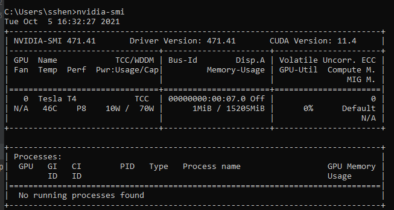

# Windows

###Install NVIDIA Driver
When you finished, you could enter `nvidia-smi` in command prompt
You are success if you see the info as below:

###Install CUDA
Visit the CUDA download page, and choose corresponding version:
[CUDA Toolkit](https://developer.nvidia.com/cuda-downloads)
install the CUDA. 
Then, enter `nvcc -V` in command prompt, you will see the CUDA version information.

###Install cuDNN
Dwonload cuDNN from page:
[cuDNN](https://developer.nvidia.com/cuda-downloads)

# CentOS
